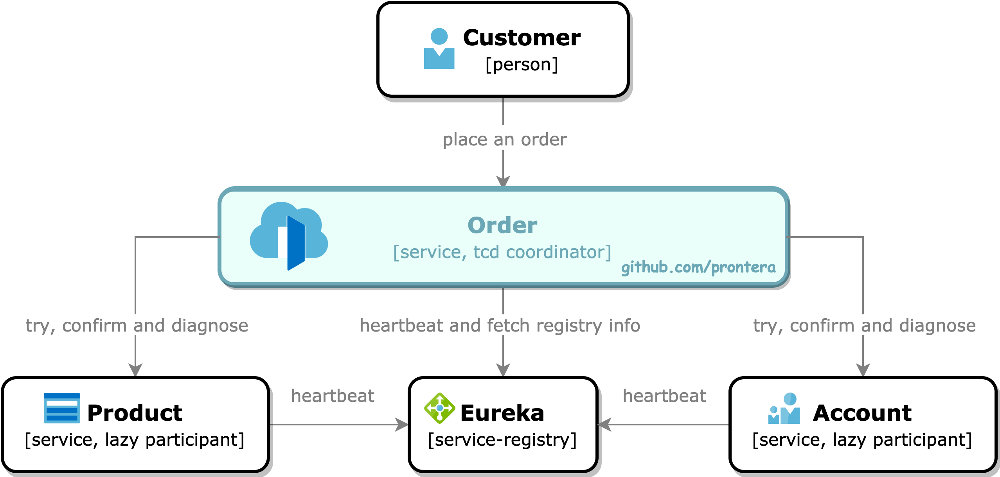
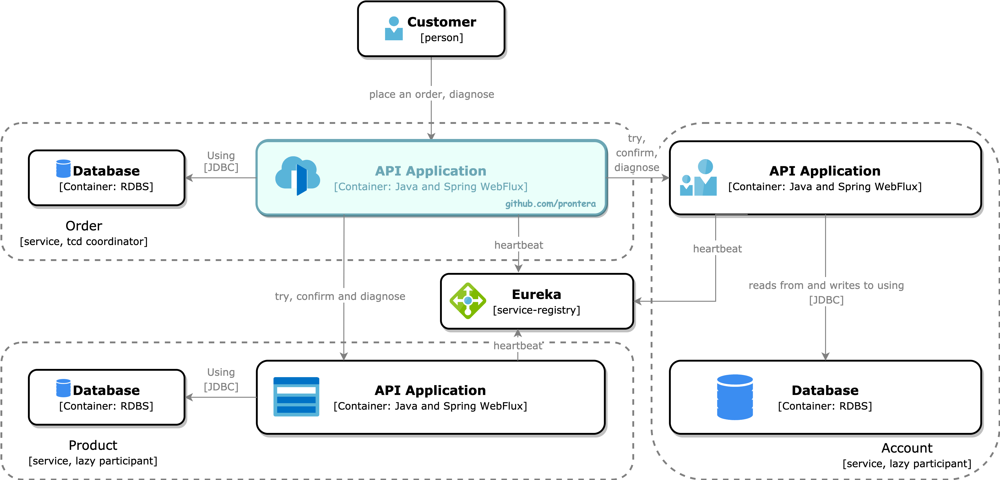
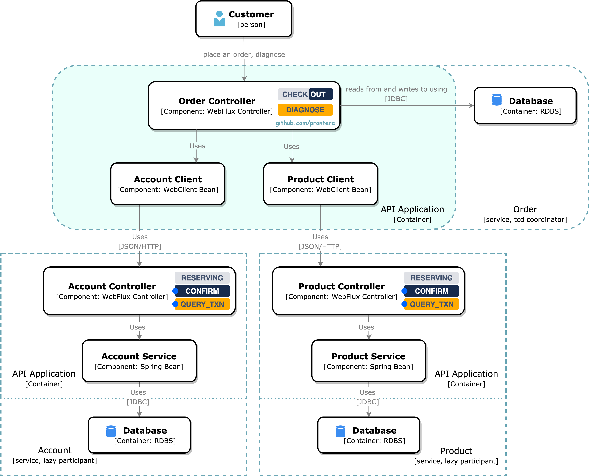
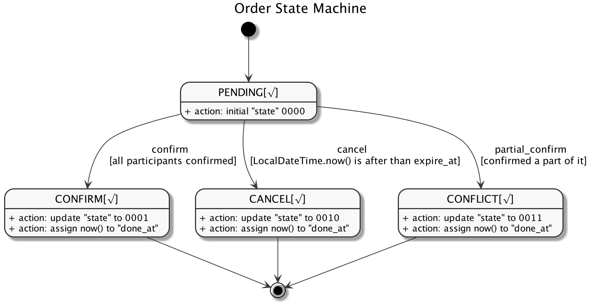
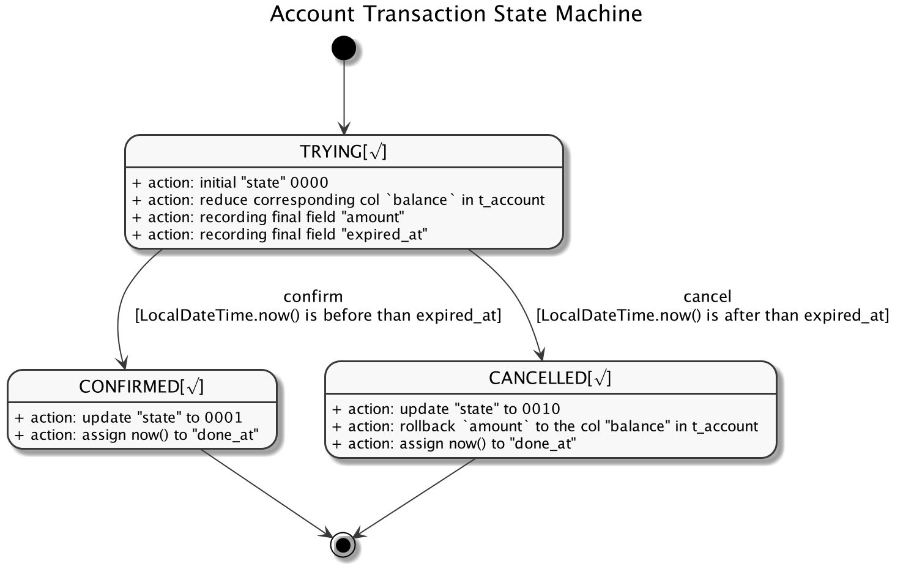
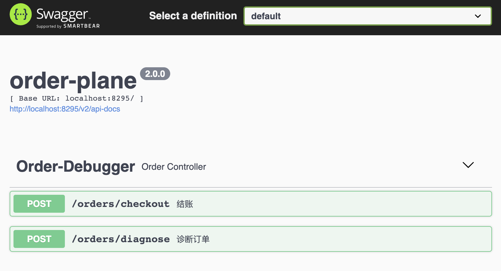

## Preface

随业务发展、组织架构变动，加上对现有系统进行析构拆分，所带来的一个显著问题是进程间一致性需求增加，是一个协作问题。Atomikos曾[撰文](https://www.atomikos.com/Blog/TCCForTransactionManagementAcrossMicroservices)介绍使用TCC作为microservice的分布式事务解决方案，[这里](https://www.jianshu.com/p/d687b620f73d)有一篇简单的译文可作为入门资料。

经文章叙述，Atomikos所设计的TCC交互完全构建在HTTP协议之上，并充分地复用了HTTP语义特性，是一个与应用层协议紧耦合的解决方案。而究其本质，TCC是作为2PC的补充，更是一种设计思想。

本文使用Spring Cloud Netflix作为服务治理基础，通篇穿插C4 Model，侧重以最简练的方式，向大家展示如何使用TCC解决分布式事务。

## Variants

在microservice兴起的时候，由于对集团内部已有的中间件生态考量与性能的实质需求，更多是以RPC协议进行构建，如gRPC、Dubbo和Thrift等框架。面对TCC设计思想，同样应该以更温和的方式落地，而不应受限于应用层协议，我们将以不同的角度阐述这种TCC的"变体"。

在模型上，将原有的HTTP语义下沉到请求体当中，上下游各自定义status code，用于识别不同状态。

在流程上，从Try-Confirm-Cancel演进为Try-Confirm-Diagnose，Try和Confirm保持抽象为API接口。而且在原则上不建议持有长周期的大事务，而小事务可确保预留资源快速回滚，所以不再视Cancel与Try-Confirm平级，建议从API接口转为功能特性融合至Try和Confirm方法当中，并且在非必要场景下不建议提供Cancel接口，避免因拜占庭问题增加轮转至conflict状态的几率。

即便是无可避免地出现conflict状态，也可以通过Diagnose接口作出诊断，追踪坏账以便人工介入处理。

出于对知识的敬重与措辞的严谨性，下文统一使用TCD指代上述理念的TCC变体。

## Scenario

假设有以下场景，我们想购入一台PS4，在付款后需要历经生单、扣减余额和扣减库存这三个过程，分别对应服务Order、Account和Product，但每一个过程中都可能会因为网络故障、宕机、网络分区或拜占庭问题，从而暴露出各种矛盾。

###### System Context Diagram



### Coordinator

Atomikos在文章[\<\<TCC for transaction management across microservices\>\>](https://www.atomikos.com/Blog/TCCForTransactionManagementAcrossMicroservices)中提出将TCC Coordinato服务化，Transaction Coordinator delivered as a service，成为一个可重用组件，负责各式各样的异常处理。

但系统的复杂度往往是随着系统内的服务数增加呈正向关系，而且数据包每多跳转一个节点就会有更多的时间耗费在网络I/O上。

在实现形式上，TCC Coordinator基于RESTful所设计的API天生具备易访问的特性，可以较为方便地对单一事务内的打包资源发起协同操作，而RPC的劣势在于序列化协议之间的天然屏障，无法做到如micrometer和service mesh理念中的*vendor-neutral*，所以TCD Coordinator示例中更倾向于将其概念依附于业务系统中，以白盒的方式管理事务。

纵观整个链路，Customer向Order发起结算请求，Order往往需要通过请求中GUID提供幂等性支持，避免网络故障与应用宕机时，因上游重试从而导致多次生单和重复预留资源的情况，同时重试策略也直接解决了failure recover后的事务恢复问题。

#### Responsibility

1. 组织并负责发起TCD事务
2. 提供诊断conflict事务的Diagnose门面接口
4. 仅对下游发起Try与Confirm操作，避免出现既Confirm又Cancel的拜占庭问题
5. 针对下游发起Try操作时，负责计算预留资源时间，并适当考虑下游因GC情况而所需增加的补偿时间

###### Container Diagram



### Lazy Participant

Lazy Participant无需启用调度器自发地将过期的TRYING状态资源轮转至CANCELLED状态，而是将这个功能隐藏在Confirm和Query Transaction接口当中，由TCD Coordinator负责驱动，以减少事务参与者的开发成本，专注于正确的状态轮转和业务逻辑即可。

在本示例当中，Account与Product充当Lazy Participant角色，分别负责余额扣减与库存扣减。

#### Responsibility

1. 提供Try操作的预留资源API接口
2. 提供Confirm操作的确认预留资源API接口，并在内部负责对过期资源的状态轮转
3. 提供事务状态查询的API接口，并在内部负责对过期资源的状态轮转，并为上游Diagnose操作提供支持
4. 对Try和Confirm两个接口实现幂等性调用

###### Component Diagram



## Final State Machine

### Coordinator



### Participant



*\* Account Transaction与Product Transaction状态机类似，故不赘述*

## Getting Started

### Technology stack

- Java 8
- Spring Boot 2.x
- Spring Cloud Netflix - Hoxton
- MySQL 8.0

### Prerequisites

在开始部署之前，先要确保MySQL有按照预期进行工作，我们有两种方法初始化DDL，根据情况选择其中一种即可。

#### Docker

在目录`assets/docker`中存放着所有与Docker相关的内容，我们可以直接找到compose文件夹，通过以下命令启动MySQL镜像。聪明的Docker会根据配置，自动将位于`mysql/db/init_mysql_user.sql`内的DDL进行初始化。

```shell
docker-compose -f database.yml up
```

#### Manual

我们亦可根据实际情况，将DDL直接导入至已有的数据源中，相关SQL位于`assets/docker/mysql/db`目录下的`init_mysql_user.sql`文件中，但需注意如果当前执行用户缺失GRANT权限，会导致执行失败，按需删减对应SQL即可。

如果一切顺利，我们会有3个账户和3个商品，分别是

| Account   | Product |
| --------- | ------- |
| chris     | **gba** |
| **scott** | ps4     |
| ryan      | fc      |

### Demonstration

将工程导入IDE后，在目录rest-tcc-projects中按下表顺序依次启动，表中同时也列出了项目的相关URL信息

| Name                       | URL                                   |
| -------------------------- | ------------------------------------- |
| rest-tcc-service-discovery | http://localhost:8255/                |
| rest-tcc-account           | http://localhost:8285/swagger-ui.html |
| rest-tcc-product           | http://localhost:8265/swagger-ui.html |
| rest-tcc-order             | http://localhost:8295/swagger-ui.html |

我们在整个流程中扮演Customer角色，通过Order服务提供的Swagger面板作为操作入口



#### checkout

在一般情况下，我们发起下单请求，Order服务会根据请求中GUID作幂等性处理，假设检测到GUID已经存在，则会恢复该事务并继续处理后续流程。并通过与上游磋商重试策略，以解决由于network failure或crash后的事务恢复问题。

```json
// request body
{
  "guid": 1,
  "price": 47,
  "productName": "ps4",
  "quantity": 1,
  "username": "chris"
}

// response body
{
  "successful": true,
  "code": 20000,
  "message": "请求成功"
}
```

Order服务基于TCD Coordinator的理念所设计，在Try阶段需根据Participant响应时间设计资源预留时长，并还需考虑Participant因GC或网络I/O所带来的耗时，适当加上补偿时间。另外为了避免服务间的Clock时钟不一致问题，报文中一律使用相对时间。

```java
reserving_secs_in_participant = reserving_secs_in_coordinator + compensation_secs
```

但墨菲定律提醒我们partial confirm的情况总是会不经意地产生，在本示例中亦人为地模拟了这一情况。假设我们选择使用账户scott去下单，总会使得confirm阶段操作发生超时而无法正确扣减账户余额；而对于产品，我们选择购买gba的时候，也总是会在confirm阶段因超时而无法扣减产品库存。

```json
/// request body
{
  "guid": 2,     //谨记需要使用不同的guid，否则会根据幂等性操作返回其他订单的状态
  "price": 47,
  "productName": "ps4",
  "quantity": 1,
  "username": "scott"
}

// response body
{
  "successful": false,
  "code": 42003,
  "message": "资源确认存在冲突"
}
```

我们可以到MySQL account库中的t_account表确认scott账号并没任何余额扣减，但在product库中的t_product表，却发现ps4库存被错误扣减（不要忘了上面chris也买了一台ps4）。此时该订单处于conflict终态，针对坏账diagnose接口可以在有限时间内，在下游Participant未清理事务流水的前提下定位问题。

#### diagnose

guid 1，chris成功买了一台ps4，除了确认Participant内部的具体扣减情况，我们还可以通过diagnose进行二次确认。

```json
// request body
{
  "guid": 1
}

// response body
{
  "successful": true,
  "code": 20000,
  "message": "请求成功",
  "stateMap": {
    "account": "CONFIRMED",
    "product": "CONFIRMED"
  }
}
```

guid 2，根据我们的设计，可怜的scott会因为超时买不到任何产品。

```json
// request body
{
  "guid": 2
}

// response body
{
  "successful": true,
  "code": 20000,
  "message": "请求成功",
  "stateMap": {
    "account": "CANCELLED",  //资源预留被取消，所以未能成功扣减账户余额
    "product": "CONFIRMED"
  }
}
```

至于其他组合情况，就留待大家继续探寻。

## End

如果对本人编码风格或设计思路等有更好的想法或建议，欢迎通过GitHub Issue留言，感谢各位耐心阅读！